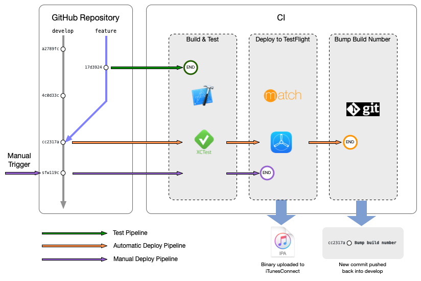

# CI/CD

Continous Integration is an important part of our development process. It allows us to move fast and be confident in our code. We use [fastlane](https://fastlane.tools) and [CircleCI](https://circleci.com) for the continuous integration.

# App Configurations

We maintain 4 different app configurations:

1. **Development** - used for the local development only.
2. **QA** - used for internal QA testing.
3. **Staging** - public Beta testing.
4. **Production** - App Store version.

# Workflow

CI/CD Workflow consist of several pipelines:
1. **Test Pipeline** - each commit in `feature/` branch triggers a Test Pipeline. Test pipeline verifies that app can be built and tests successeds.
2. **Automatic Deploy Pipeline** - each commit in `develop` branch triggers an Automatic Deploy Pipeline. This pipeline builds, tests the app, deploys a **QA** build and bumps build number of the app.
3. **Manual Deploy Pipeline** - is triggered manually via API call to our CI provider. CI takes the latest code on `develop` or `master` and deploys **Staging** or **Production** build accordingly.




# How to setup CI/CD for your project?

## 1. Setup fastlane

fastlane is a shortcut for day-to-day developers tasks. It saves our time by automating the boring things like building and deploying the app or adding a device to the developer profile.

fastlane scripts are written in Ruby. The main file is called **Fastfile**. Usually Fastfile consists of several **lanes**. Lane is just a sequence of **actions**, such as `build_ios_app`, `hockey` or `slack`. For more information refer to the [docs](https://docs.fastlane.tools). 

#### Basic Setup

The [basic Fastfile](resources/Fastfile-Basic) contains the minimalistic set of lanes, needed to build and deploy a project on a CircleCI. Lane `test` just builds the project and runs the tests suite. Usually, this lane is run on every push to any branch. Lane `deploy` is a bit more complicated as it has more steps:

1. Retrieve certificates using `match`.
2. Build the app.
3. Deploy an app to the HockeyApp
4. Send a message to the slack channel.

`deploy` lane is run on every merge to the `develop` branch.

#### Advanced Setup

Usually, basic setup is not enough, as we have several application configurations and we deserve to have nice things. In the [advanced Fastfile example](resources/Fastfile-Advanced) you can check typical fastlane configuration used in our projects. There are lanes for running tests, deploying Staging and Production builds, helper lanes for syncing provisioning profiles and adding a new iOS device to the developer profile.

Whoa, a lot of Ruby code! Don't be afraid, it's pretty easy to follow. In addition, setting up the fastlane on the project makes you feel like a cool dev-ops 😎 

Code signing part is described in the [code signing chapter](2-code-signing.md). If you use match there will be no problems, just grant your CI machine SSH access to the certificates repo.

## 2. Configure the CircleCI

CircleCI uses `config.yml` file for configuration, which is located in `.circleci/config.yml`. **It's  role is to determine which pipeline to use in the given context and to setup the environment for the fastlane execution.**

#### Example

A configuration file example - [config.yml](resources/circle-config.yml). It consists of 4 jobs which represent our CI pipelines: 
* `build-and-test` - Test Pipeline
* `deploy_qa` - Automated Deploy Pipeline
* `deploy_staging` and `deploy_production` - Manual Deploy Pipelines

#### Workflow triggers

At the very bottom of `config.yml` lays description of our workflow. It states, that 
* we will run `build-and-test` job on push to every branch **except** `develop`; 
* we will run `deploy_qa` job on every push to the `develop`.

To trigger a Manual Deploy Pipeline, you should use a CircleCI API call with required job name and branch to use for build:

```
curl -u {TOKEN}: \
     -d build_parameters[CIRCLE_JOB]={JOB_NAME} \
     https://circleci.com/api/v1.1/project/github/uptechteam/{PROJECT_NAME}/tree/{BRANCH_NAME}
```

> Please, refer to the [config.yml documentation](https://circleci.com/docs/2.0/configuration-reference/) for more information about the structure of the configuration file.

### 3. PROFIT 🚀

- we've automated part of our workflow;
- our code is always buildable and tests are green;
- the latest executable build is always available to download.
